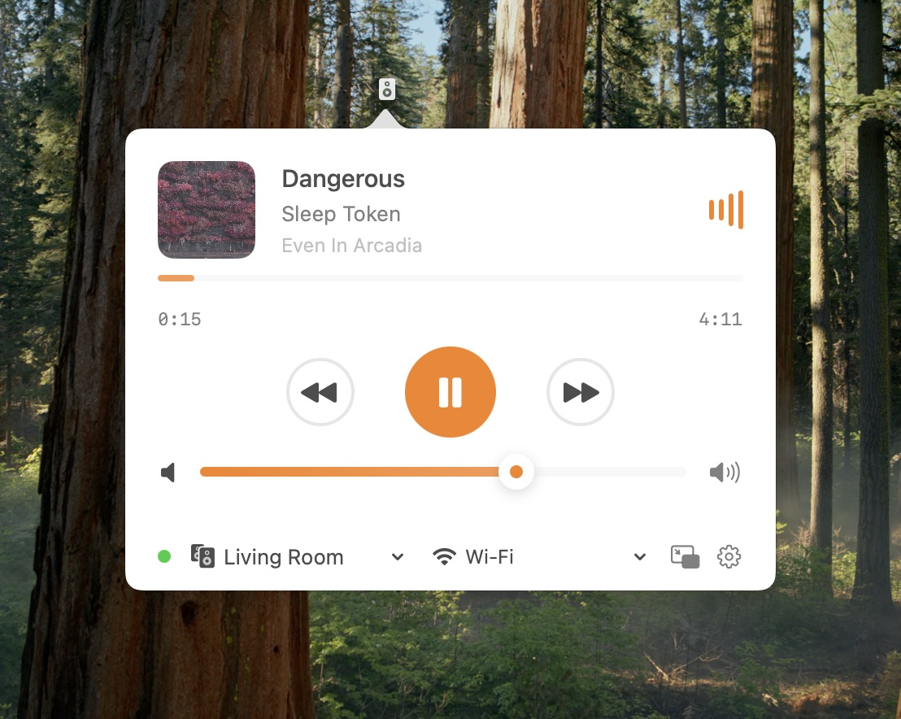

  

# Kefir - KEF Speaker Control for macOS

A beautiful menubar app that puts your KEF wireless speakers at your fingertips. Control volume, switch sources, and see what's playing - all without leaving your current task.

## Screenshots

## Features

### 🎵 Real-Time Control
- **Live Updates** - See volume changes and playback status instantly
- **Now Playing** - Album art, track info, and progress bar for your music
- **Smooth Animations** - Beautiful, responsive interface that feels native

### 🎛️ Complete Speaker Control
- **Volume Control** - Adjust with slider, buttons, or keyboard shortcuts
- **Source Switching** - Quick access to Wi-Fi, Bluetooth, TV, Optical, and more
- **Power Management** - Turn speakers on/off from your Mac
- **Multiple Speakers** - Save and switch between different KEF speakers

### 🎪 Mini Player
- **Floating Window** - Keep controls visible while you work
- **Smart Design** - Shows track info, hover for playback controls
- **Draggable** - Position it anywhere on your screen

### ⌨️ Global Shortcuts
Set up keyboard shortcuts for:
- Volume up/down
- Mute/unmute
- Play/pause
- Skip tracks

## Getting Started

### Requirements
- macOS 13.0 or later
- KEF wireless speakers (LSX II, LS50 Wireless II, or LS60)
- Speakers and Mac on the same network

### Installation

1. Download the latest release from the [Releases](https://github.com/melonamin/Kefir/releases) page
2. Drag Kefir to your Applications folder
3. Launch Kefir from Applications

### First Time Setup

1. **Launch Kefir** - Look for the speaker icon in your menubar
2. **Add Your Speaker**:
   - Click the menubar icon → Settings
   - Click "Add Speaker"
   - Enter a name (e.g., "Living Room")
   - Enter your speaker's IP address
3. **Optional**: Set up keyboard shortcuts in Settings

### Finding Your Speaker's IP Address

- Check your router's connected devices list
- Use the KEF Connect app on your phone
- Look in your speaker's network settings

## How to Use

### Basic Controls
- **Click the menubar icon** to open controls
- **Adjust volume** with the slider or +/- buttons
- **Switch sources** by clicking the source buttons
- **Toggle power** with the power button

### Playing Music
When streaming via Wi-Fi or Bluetooth:
- See current track with album art
- Control playback (play/pause, skip)
- Watch real-time progress
- All controls update live

### Mini Player
Perfect for keeping controls handy:
- Open from menubar → "Show Mini Player"
- Drag to position anywhere
- Hover to reveal full controls
- Shows current track and progress

### Keyboard Shortcuts
Speed up your workflow:
- Set custom shortcuts in Settings
- Control volume without clicking
- Play/pause from any app
- No need to switch windows

## Tips & Tricks

- **Default Speaker**: Set your most-used speaker as default for instant connection
- **Mini Player**: Great for parties - keep controls visible while using other apps
- **Shortcuts**: Try `Option + Arrow Keys` for volume control
- **Multiple Speakers**: Each speaker remembers its last state

## Troubleshooting

### Can't find your speaker?
- Make sure speaker is powered on
- Check both devices are on the same Wi-Fi network
- Try restarting your speaker
- Verify the IP address is correct

### Keyboard shortcuts not working?
- Grant accessibility permissions when prompted
- Check System Settings → Privacy & Security → Accessibility
- Make sure Kefir is listed and enabled
- Restart Kefir after granting permissions

### Connection issues?
- Check your network connection
- Make sure no firewall is blocking the app
- Try using a wired connection for your speaker
- Restart both your Mac and speaker

## Support

Having issues or suggestions? 
- Report problems on our [GitHub Issues](https://github.com/melonamin/Kefir/issues) page
- Check for updates regularly for new features and fixes

## License

MIT License - see [LICENSE](../LICENSE) file for details.

---

🎵 Made for music lovers who appreciate both great sound and great software
